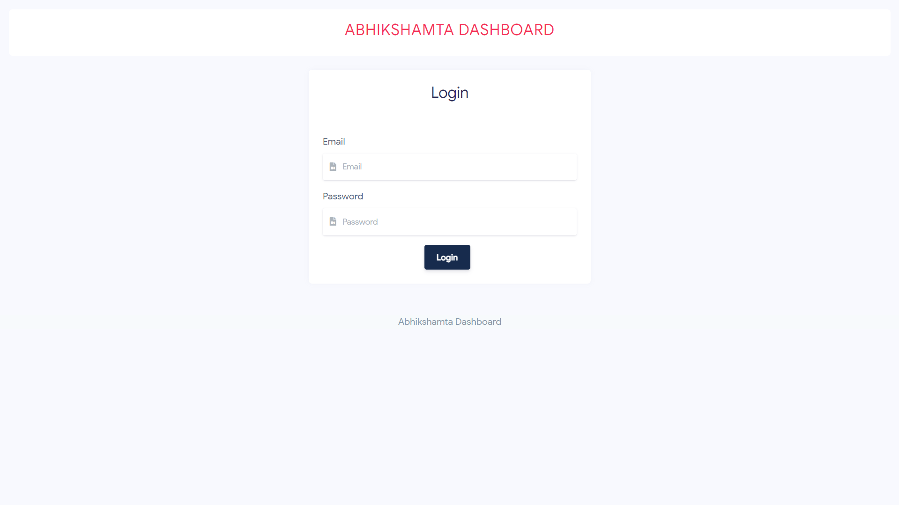
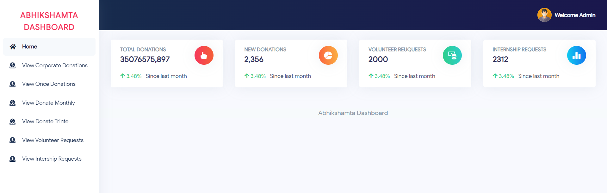

# Abhikshmata Education Foundation

### Description
Developed a web platform for the Abhikshmata Education Foundation, a nonprofit organization focused on providing education to orphans and underprivileged children. The platform facilitates donations and enables users to learn more about the foundation’s mission, events, and success stories. The goal was to create a user-friendly and visually appealing site that encourages community engagement and supports the foundation’s objectives
### Key Features
- Donation Management System: Streamlined donation process with secure payment gateway integration.
- Event and Campaign Showcase: Displayed ongoing and upcoming events to raise awareness and participation.
- Impact Stories and Blog Section: Highlighted success stories, inspiring visitors and showcasing the foundation’s efforts.
- Responsive Design: Ensured accessibility across all devices for a seamless user experience.
- Custom Design Implementation: Transformed Adobe XD designs into a fully functional website, ensuring a pixel-perfect match between the design and the final product.

### Technologies Used
- Core PHP
- Bootstrap
- Mysql
- Ajax, JQuery

### Walkthrough
#### Frontend
https://github.com/Jsprajapati/Project-Portfolio/blob/main/Abhikshmata%20Education%20Foundation/Abhikshamta-Frontend.mp4

#### Backend
https://github.com/Jsprajapati/Project-Portfolio/blob/main/Abhikshmata%20Education%20Foundation/Abhikshamta-Backend.mp4
### Screenshots
#### Backend

