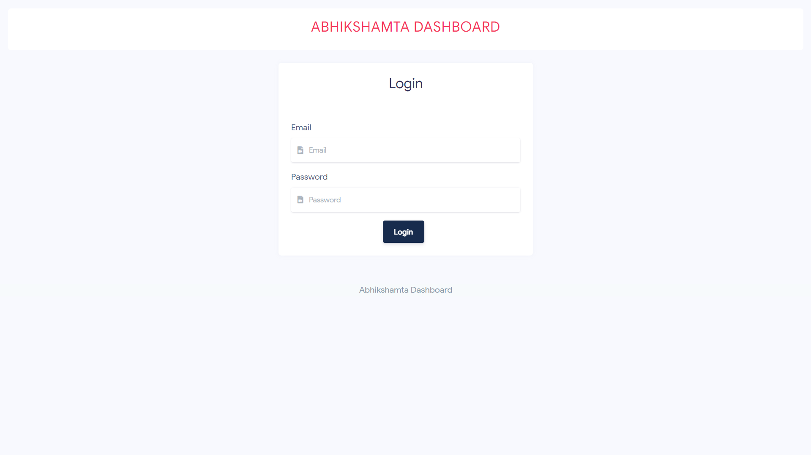
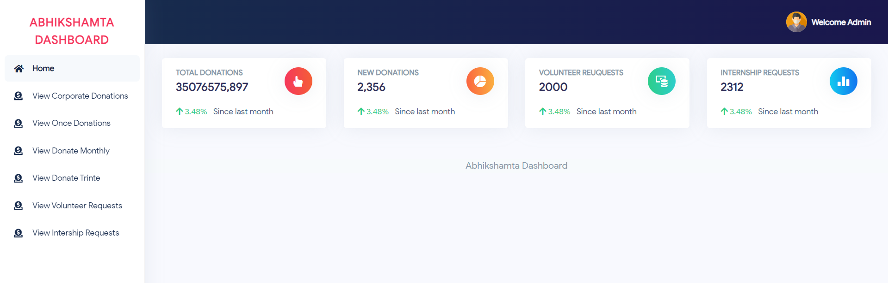

# Abhikshamta

### Description
Developed a platform for a non-profit foundation focused on educating orphans and underprivileged children.

### Key Features
- Donation management system.
- User-friendly admin dashboard for content management.
- Responsive design based on Adobe XD prototypes.

### Technologies Used
- PHP
- Mysql
- BS4, Ajax, JQuery

### Walkthrough
#### Frontend
https://github.com/user-attachments/assets/f2880f08-630c-48d3-8073-31d456c440c9

#### Backend
https://github.com/user-attachments/assets/33c1a7ce-ed2d-4b49-afd4-c3fac9413b12

### Screenshots
#### Backend

