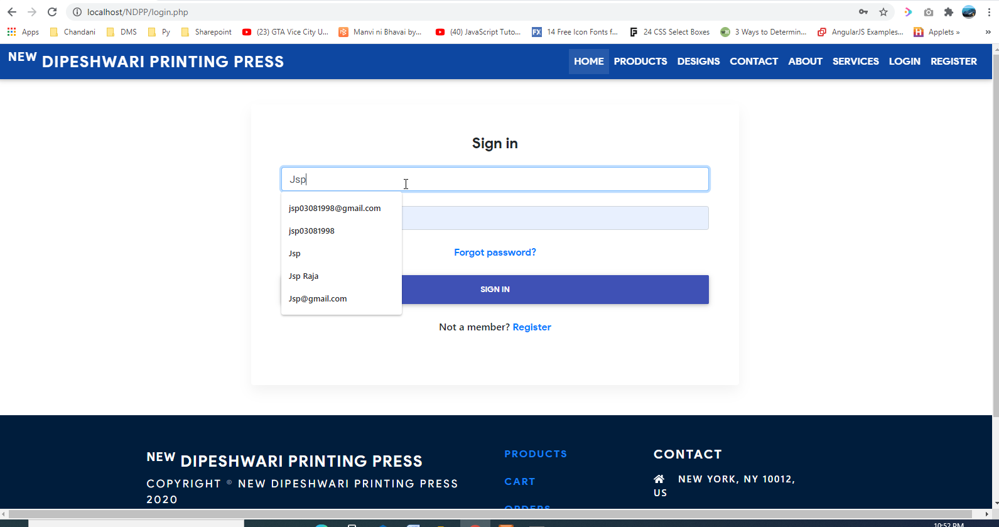
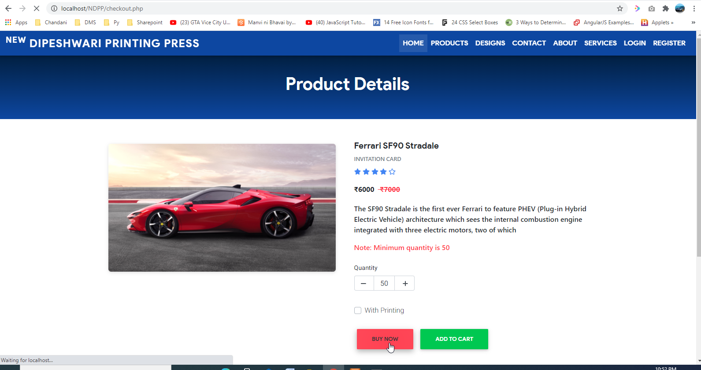
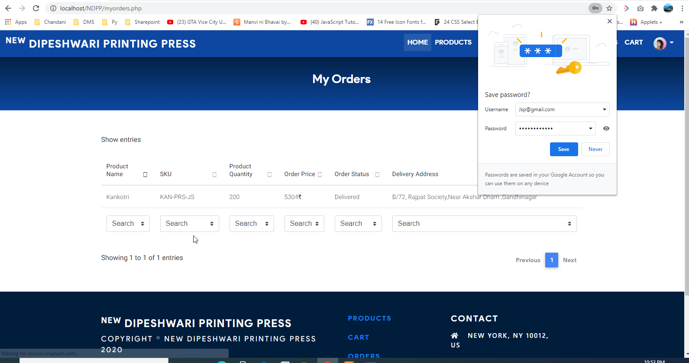
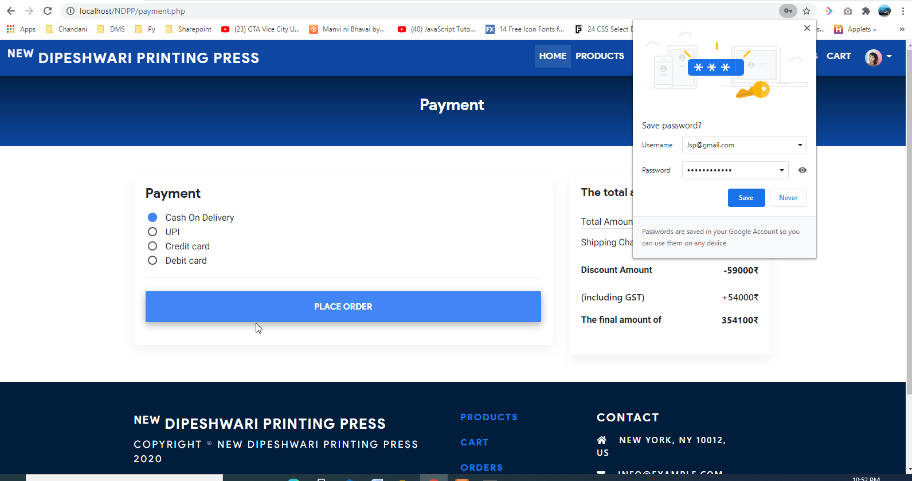
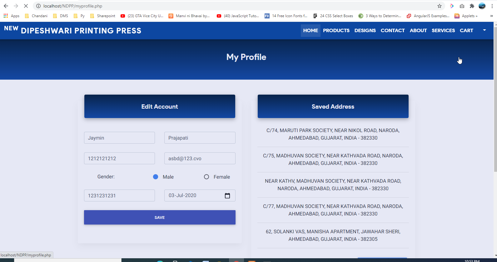

# E Commerce Platform

### Description
E-commerce platform designed for selling custom Kankotri, gift cards, and invitation cards with seamless online ordering and personalization options

### Key Features
- Guest and Registered User Login: Allows both guest checkouts and registered users to access personalized features.
- Profile Management: Users can manage profiles, update personal details, and save multiple delivery addresses for easy access during checkout.
- Responsive Design: Ensures a consistent shopping experience across desktops, tablets, and mobile devices.
- Admin Panel with Full Control: Admins can manage product listings, pricing, inventory, and promotions through a user-friendly dashboard.

### Technologies Used
- Core PHP, MySQL
- Ajax, Bootstrap, JQuery

### Walkthrough
https://github.com/user-attachments/assets/97ac5c96-3aa3-42bf-a634-608dc5c672b0

### Screenshots

### Contributors
- [Ravi Prajapati](https://www.linkedin.com/in/raviprajapati14)
