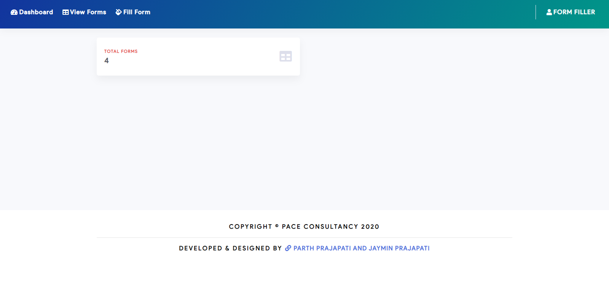

# Labharthi Checklist Survey Management (PMAY - GRAMIN)

### Description
The Labharthi Checklist Survey Management project was developed for Pace Consultants & Engineers as part of the Pradhan Mantri Awas Yojna (PMAY - GRAMIN). The platform was designed to streamline the survey process for identifying beneficiaries under the government’s housing scheme, ensuring a smooth and transparent data collection process for both field officers and administrators.

### Key Features:
- Survey Data Collection and Management: Efficiently captures beneficiary data, making it easy for field officers to collect, store, and update information in real-time.
- Checklist and Approval Workflow: Implements an organized checklist for verifying eligibility criteria, ensuring accurate assessments and streamlined approvals.
- Role-Based Access Control: Provides specific access levels for field officers, administrators, and supervisors for data security and seamless workflow management.
- Automated Reports and Analytics: Generates automated reports and insights, helping decision-makers evaluate survey results and take informed actions.

### Technologies Used
- Core PHP, MySQL
- Ajax, Bootstrap

### Screenshots

### Contributors:

