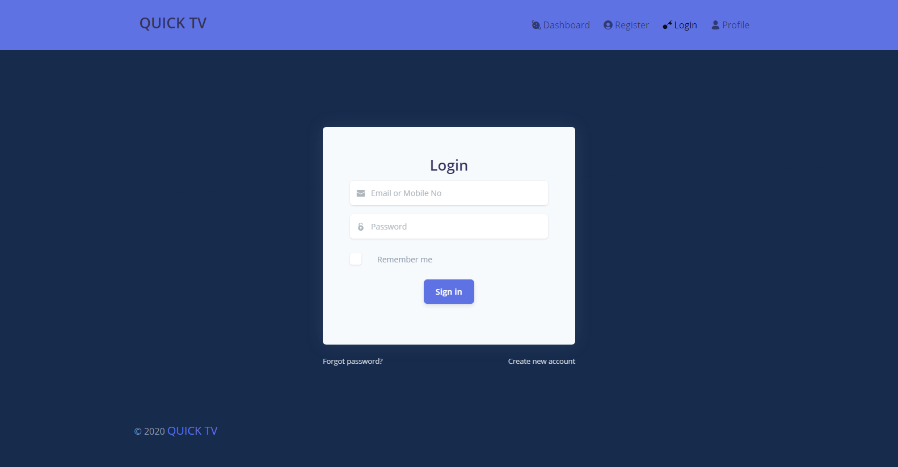
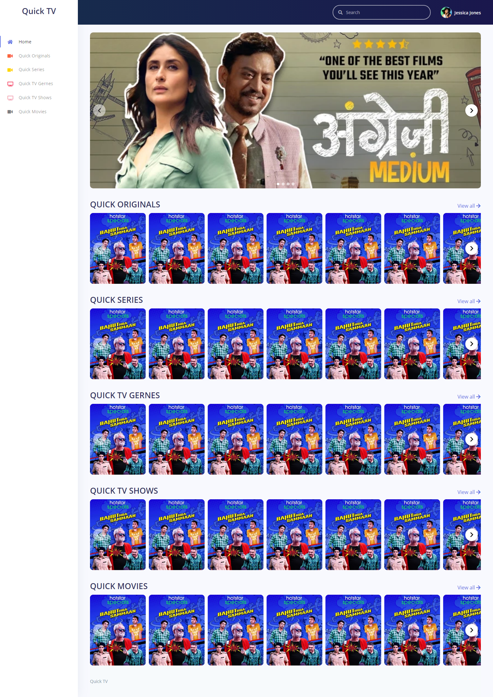
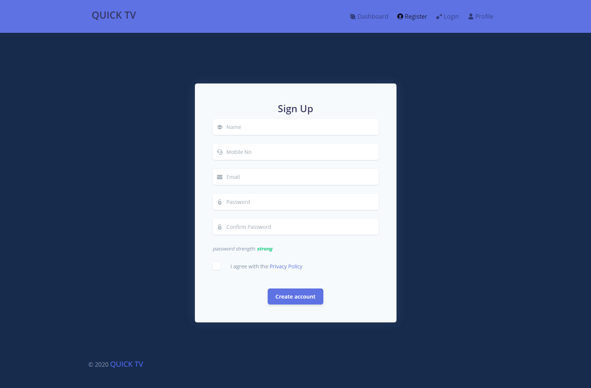
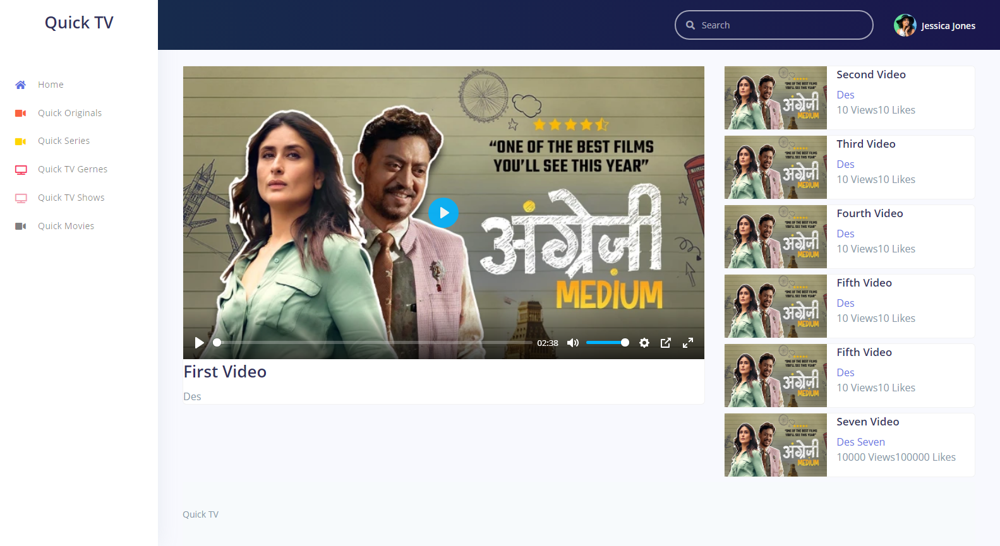

# Quick TV OTT Platform

### Desciption
QuickTv is an OTT (Over-the-Top) platform developed for popular Indian television personalities Harsh Limbachiya and Bharti Singh. This platform offers users a wide range of entertainment content, including exclusive shows, movies, and live events. Built with a focus on delivering high-quality streaming services and engaging user experiences, QuickTv stands out as a premium platform in the digital entertainment space.

### Features
- Content Streaming and On-Demand Video: Seamlessly delivers high-definition content, allowing users to watch exclusive shows and events anytime.
- User Profiles and Watchlists: Personalized user accounts with tailored recommendations and watchlists for a customized viewing experience.
- Multi-Platform Access: Compatible across web, mobile, and smart TV devices for consistent streaming.
- Admin and Content Management Panel: Provides a robust backend for content uploads, schedule management, and user control.

### Technologies Used
- Express.js
- Mysql
- Core PHP
- Angular
- Bootstrap
- Ajax, JQuery

### Screenshots

