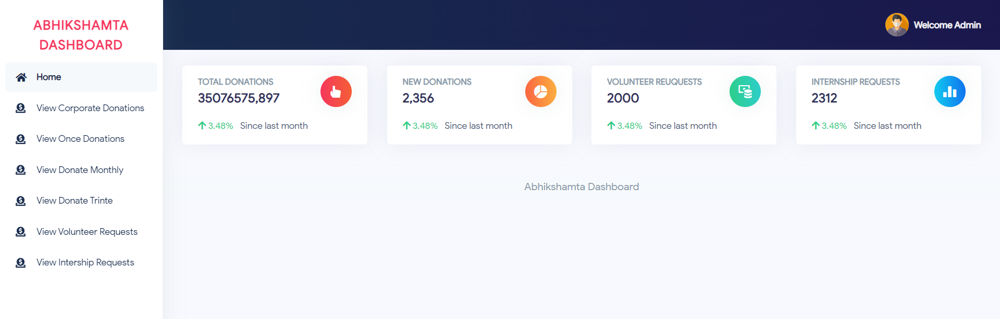

# Freelance Projects Portfolio

Welcome to my Freelance Projects Portfolio! Below is an overview of the key projects I have completed during my freelance journey. Each project is tailored to meet unique client needs, showcasing my versatility and ability to deliver impactful solutions across various domains.

## Projects Overview

### [PMAY-Gramin](./PMAY-Gramin)
Digital survey management system for the Pradhan Mantri Awas Yojna (GRAMIN) initiative, streamlining the labharthi checklist for government consultants.

---

### [Abhikshmata Education Foundation](./Abhikshmata-Education-Foundation)
Nonprofit platform developed for educating orphans and underprivileged children, enabling smooth donation management and resource allocation.

---

### [QuickTv](./QuickTv)
Developed an OTT platform for Harsh Limbachiya and Bharti Singh, integrating seamless streaming, subscription management, and user engagement tools.

---

### [E-Commerce](./E-Commerce)
E-commerce platform for selling customized Kankotri, invitation cards, and gift items, with a user-friendly interface and secure payment gateway.

---

### [Auto Question Paper Generation System](./Auto-Question-Paper-Generation-System)
Question paper generation system.
TODO

---

### [Srashtasoft Scholarship Management System](./Srashtasoft)
A scholarship management platform for educational institutions to streamline student applications and award processing.

TODO

---

Feel free to explore each project folder for more details, including screenshots and feature descriptions.
